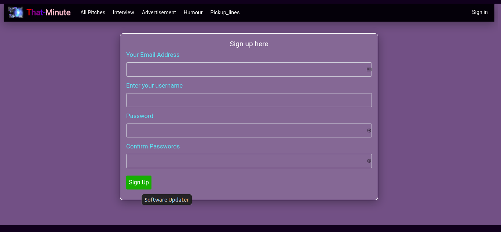

# That-Minute
#### This is a project on a python language to implement the a one minute life-changing pitch. A kind of life changing quotes.


 
 ***Tuesday November 9 2021*** 
#### By **OMOLO LEVY**&trade;


## Project Description
This is an application that will help the user with a list of pitches. In life, we only have 60 seconds to impress someone. 1 minute can make or break anyone.
</br>

With this app, a user is able to:
* See the pitches other people have posted.
* Vote on the pitch they liked and give it a downvote or upvote.
* Be signed in for me to leave a comment
* Beceive a welcoming email once I sign up.
* View the pitches I have created in my profile page.
* Comment on the different pitches and leave feedback.
* Submit a pitch in any category.
* View the different categories.

## Project live sites
  * This is the live [link to the repo ](https://github.com/omololevy/That-Minute) <br>
  * This is the live [link to the app ](https://thatminute.herokuapp.com/)


## Homepage Demo
The app looks like this: 
  

## Setup instructions
* Create a virtual environment in your project directory through the terminal with the command: <br>
```$ python3.9 -m venv --without-pip virtual```

* Activate the virtual environment:<br>
```$ source virtual/bin/activate ```

* Install pip for installing other necessary python packages:<br>
```$ curl https://bootstrap.pypa.io/get-pip.py | python```

* Install flask module:<br>
```$ pip install flask```

* Clone the program from the [online repo](https://github.com/omololevy/That-Minute)
* Click on the <button style="background-color:green;"><a href= "https://github.com/omololevy/That-Minute" style= "color:white">code</a> </button> button to clone or download

## The App Structure
~~~
|-That-Minute
    |-app/
        |-auth/
            |-__init__.py
            |-forms.py
            |-views.py
        |-main/
            |-__init__.py
            |-errors.py
            |-forms.py
            |-views.py
        |-static/
            |-css/
            |-photos/
        |-templates/
            |-auth/
                |-login.html
                |-register.html
            |-email/
                |-welcome_user.html
                |-welcome_user.txt
            |-profile/
                |-profile.html
                |-update.html
            |-base.html
            |-comments.html
            |-errors.html
            |-filter_pitch.html
            |-footer.html
            |-index.html
            |-macros.html
            |-navbar.html
            |-new_pitch.html
        |-__init__.py
        |-email.py
        |-models.py
    |-migrations/
    |-tests/
        |-test_comments.py
        |-test_downvote.py
        |-test_pitch.py
        |-test_upvote.py
        |-test_user.py
    |-virtual/
    |-config.py
    |-.gitignore
    |-LICENSE
    |-manage.py
    |-Procfile
    |-README.md
    |-requirements.txt
    |-start.sh
~~~
## Deployment
* ```$ heroku login```
* ```$ heroku create <name-of-app>```
* ```$ heroku config:set MAIL_USERNAME=<YOUR EMAIL ADDRESS>```
* ```$ heroku config:set MAIL_PASSWORD=<YOUR EMAIL PASSWORD>```
* ```$ heroku addons:create heroku-postgresql```
* ```$ git push heroku master```

## Database Migration
* ```$ heroku run python3.9 manage.py db stamp head```
* ```$ heroku run python3.9 manage.py db migrate```
* ```$ heroku run python3.9 manage.py db upgrade```

## Technologies Used
* Python
* HTML
* CSS
* Bootstrap
* Flask

## Pending Issues
* The footer is not yet polished to the required state.

* Therefore, you can make a [pull request](https://github.com/omololevy/That-Minute/pulls) to this repo improve it or adjust functionalities.

## Support and contact details
Contact me omololevy@gmail.com
### License
The project is under [MIT LICENSE](https://github.com/omololevy/That-Minute/blob/master/LICENSE) 
Copyright &copy; 2021.All rights reserved
  